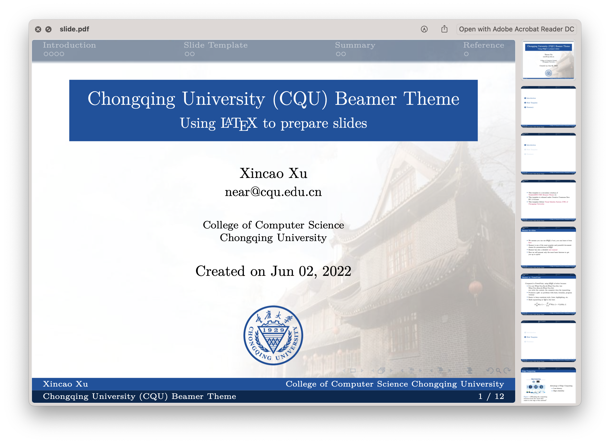
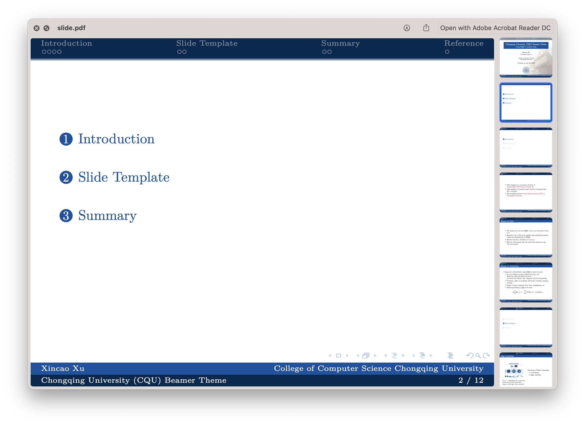
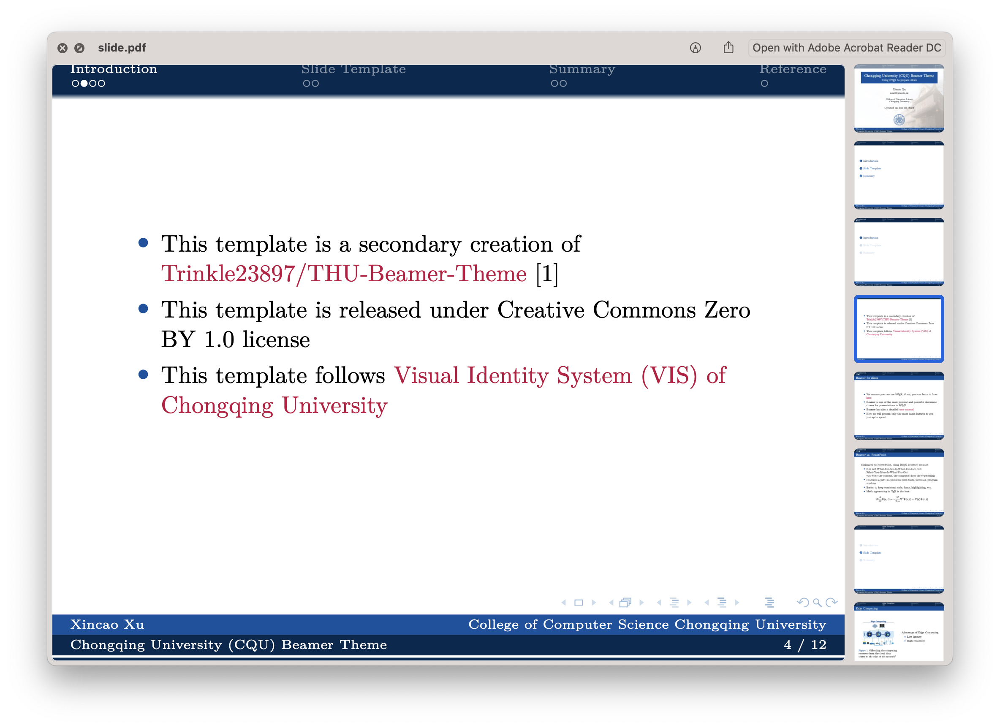

# Chongqing-University-CQU-Beamer-Theme
Chongqing University (CQU) Beamer Theme for using LaTex to prepare slides

## Example

<div align="center">
	
</div>

<div align="center">
	
</div>

<div align="center">
	
</div>

## Getting started

1. Fork or Clone this repo
   ```bash
   git clone git@github.com:neardws/Chongqing-University-Beamer-Theme.git
   ```

2. Open the "slide.tex" in your LaTex editor, such as [Overleaf](https://www.overleaf.com/)    
   BTW, if you are using MacOS, the [texifier](https://www.texifier.com/mac) is a good-choice

3. File structure is listed as follows.
   - slide.tex - main LaTex file consists of content
   - ref.bib - reference bibTex file 
   - cqu.sty - style file defines the background color and others
   - fig/background.pdf - background image shows the office of the principal
   - fig/Chongqing_University_Logo.pdf - Logo of Chongqing University